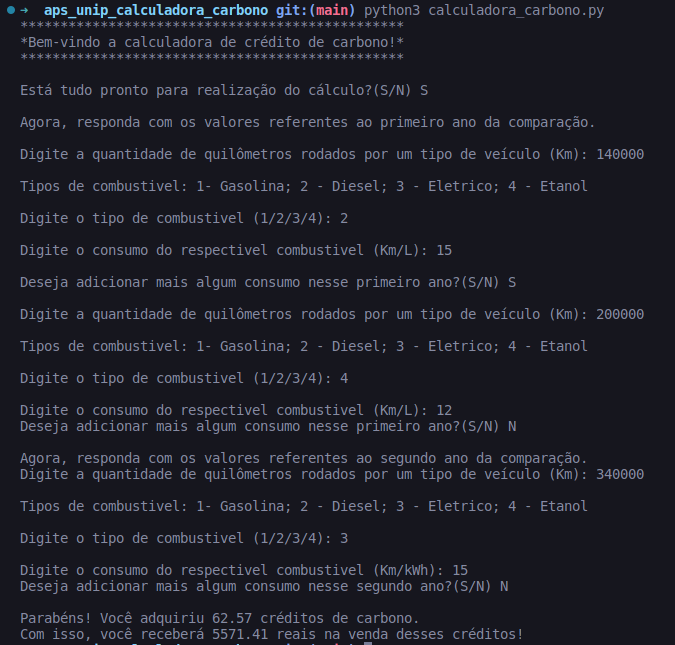

<h1>Calculadora de Carbono</h1>

Este repositório contém arquivos de um projeto proposto pela UNIVERSIDADE PAULISTA - UNIP. O qual consiste em uma calculadora de crédito de carbono pensado para as empresas
de logística, no qual retorna o quanto de carbono emitido dependendo de vários fatores, como tipo de combustível, quilômetros rodados e  etc. Ao final do programa retorna se a empresa recebe algum dinheiro dependendo da comparação dos dois anos informados ou se terá que comprar créditos de carbono para compensar sua emissão de carbono.

## Instalação
**É necessário apenas certificar de ter o Python versão 3 ou superior instalado em seu sistema.** Caso não tenha, você pode baixá-lo e instalá-lo a partir do [site oficial do Python](https://www.python.org/).

## Uso
Execute o arquivo `calculadora_carbono.py` com o comando:
```
python calculadora_carbono.py
```
Pronto! Agora só testar com diferentes informações! :)
### Exemplo:
